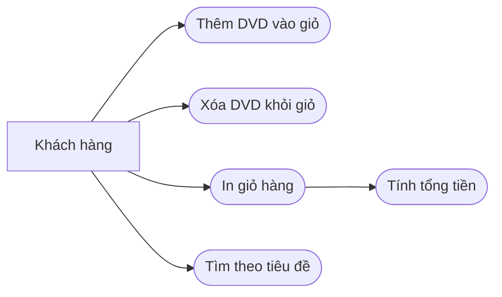

# Use case AIMS-mini

```mermaid
flowchart LR
    Customer[Khách hàng] --> Add([Thêm DVD vào giỏ])
    Customer --> Remove([Xóa DVD khỏi giỏ])
    Customer --> Print([In giỏ hàng])
    Customer --> Search([Tìm theo tiêu đề])
    Print --> Total([Tính tổng tiền])
```

Điều kiện: giỏ tối đa 20 DVD theo đặc tả; kiểm tra và sửa lỗi giới hạn ở Lab 03. Tìm kiếm theo một phần tiêu đề.
